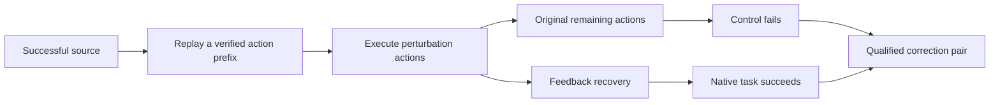

# Robot Stack

**Collect successful demonstrations, induce execution errors, and verify recovery in real simulator dynamics.**

[](https://github.com/pm1255/robot_stack/actions/workflows/ci.yml)
[Live dashboard](https://pm1255.github.io/robot_stack/) · [中文](README.zh-CN.md) · [Correction protocol](docs/correction-protocol.md) · [Collection results](docs/benchmarks.md) · [Contributing](CONTRIBUTING.md)

Robot Stack is a research collection toolkit for **paired error-and-recovery data**. It separates simulator adapters, task policies, native success checks and dataset bookkeeping. It retains failed attempts, counts every injected/recovery action, and checks that both branches start from the same perturbed state.

> Current controllers use privileged simulator state or upstream scripted experts. These are collection experiments, not learned-policy benchmark scores. New tasks still need a capable policy and an appropriate success oracle.


Native MetaWorld action replay: source / perturbed control / recovery. Rendered at a viewing frame rate; not physical-time playback.

## Why paired trajectories?

A successful endpoint alone does not prove correction. Each eligible sample contains:



Both branches reconstruct the source prefix through actual actions. Recovery never resets the environment, teleports the robot, attaches the object, or installs a successful simulator state. The protocol measures recovery from a specified injected error; it does not claim superiority over another closed-loop policy.

## What has actually run?

| Integration | Native collection evidence | Perturbation / recovery |
| --- | --- | --- |
| MetaWorld 3.1.1 | 8 selected tasks, **80/80** successful demonstrations | Generic three-branch protocol: **10/10 qualified pairs** across push and pick-place, five distinct task instances each |
| robosuite Lift | 20/20 clean, 0/20 grasp-offset control, 20/20 recovery | Earlier bounded retry experiment; distinct from the new source-prefix branching protocol |
| ManiSkill 3.0.1 | 4 tasks, **18/20** | Native expert collection and independent action replay; generic corrections not integrated yet |
| RoboTwin | 3 tasks, **6/9** | Native expert collection and stored-path replay; generic corrections not integrated yet |
| RoboCasa 1.0.1 | Native NavigateKitchen adapter implemented; asset/runtime validation in progress | Experimental, no verified success claim yet |
| AI2-THOR 5.0.0 | Native grid-navigation adapter implemented; Unity runtime validation in progress | Experimental, no verified success claim yet |
| RoboDojo | Bridge checked against official EvalEnv API, upstream commit `726e9aab` | Contract-tested only; requires Isaac runtime, assets and a real policy |

The 10 MetaWorld pairs are a small, fixed-configuration experiment: task indices 0–4, reset seeds 220–224, a 15-step Cartesian error burst, and a 500-action cap. All failures and non-qualifying attempts remain in the dataset. This is not complete MT10/MT50 evaluation. See [data semantics](docs/correction-protocol.md) and [earlier benchmark conditions](docs/benchmarks.md).

## Reproduce a correction experiment

Use a separate Python 3.10 environment for each simulator. The core itself needs only NumPy and h5py.

```bash
git clone https://github.com/pm1255/robot_stack.git
cd robot_stack
python -m venv .venv
source .venv/bin/activate
pip install -e '.[metaworld]'

MUJOCO_GL=egl OPENBLAS_NUM_THREADS=1 OMP_NUM_THREADS=1 \
  robot-stack-collect --backend metaworld --task pick-place-v3 \
  --output outputs/pick-place --episodes 5 --seed-start 220 \
  --max-steps 500 --perturb-steps 15

python -m robot_stack.audit outputs/pick-place --output outputs/pick-place-audit.json
robot-stack-replay outputs/pick-place/ep_0220/recovery.hdf5 \
  --output outputs/replay.json --video outputs/recovery.mp4
```

Replay video needs EGL and FFmpeg. Each new run requires a new output directory. MetaWorld uses different native task indices by default; setting `task_index` explicitly in `--adapter-options` intentionally holds that task instance fixed.

```text
outputs/pick-place/
  run_config.json
  summary.json
  ep_0220/
    source.hdf5                 # successful source
    perturbed.hdf5              # original suffix after injected actions
    recovery.hdf5               # feedback from the same error state
    *_episode_result.json      # native outcome, provenance, SHA256
    correction.json            # eligibility and paired-state checks
```

The HDF5 files contain T actions, T post-action success labels and T+1 states. Phase labels and half-open action ranges identify the perturbation and recovery. Use **`split_group`**, not episode filenames, when splitting training and validation; identical initial states are conservatively grouped even if reset seeds differ.

## Navigation and extending tasks

The new adapter API is in [`robot_stack/core.py`](robot_stack/core.py). A policy chooses actions; an adapter executes them, returns numeric state and evaluates the task. The core handles branching, provenance, budgets and paired labels. Implement an adapter and call `collect_triplet(...)` to use a different policy or task.

- **RoboCasa:** the current controller targets native `NavigateKitchen` using PandaOmron base velocities and the environment's position/orientation success check. It requires matching kitchen assets. It is not yet a general collision-aware mobile manipulation planner.
- **AI2-THOR:** the current adapter performs oracle PointNav in a native `FloorPlan` scene using `GetReachablePositions`, grid planning, physical moves and rotations. This is not official ObjectNav evaluation. It records agent pose in a static scene, not a full Unity snapshot.
- **RoboDojo:** the bridge accepts a caller-created official `EvalEnv`, a real policy callback, a state reader and a perturbation generator. `success=True` alone is insufficient: native completion and actual execution are also required. See [integration setup](docs/navigation.md).

The original Isaac/A2D pipeline remains in `isaac_collector/`; its planner/execution checks have been improved, but its task completion is still unverified. [Implementation notes](docs/implementation-history.zh-CN.md) document that boundary.

A small [native correction triplet](examples/correction/) is included for inspection. Validate its files without a simulator: `python -m robot_stack.audit examples/correction --output /tmp/robot-stack-example-audit.json`.

## Inspect results and contribute

```bash
python scripts/build_collection_report.py --input outputs/pick-place --output docs/report.json
python -m http.server 8000 --directory docs
python -m unittest discover -s tests -v
```

The static dashboard shows real records and local videos, and can be deployed with the GitHub Pages workflow. CI runs lightweight contract tests; native simulator checks are separate and must not be inferred from a green CI badge.

Next milestones are collision-aware navigation, more task policies, controlled natural-failure recovery, and environment-specific MimicGen subtask annotations. **MimicGen generation is not implemented yet.** A simulator name or HDF5 extension is not a compatibility guarantee.

We build on [robosuite](https://github.com/ARISE-Initiative/robosuite), [MetaWorld](https://github.com/Farama-Foundation/Metaworld), [ManiSkill](https://github.com/haosulab/ManiSkill), [RoboTwin](https://github.com/RoboTwin-Platform/RoboTwin), [RoboCasa](https://github.com/robocasa/robocasa), [RoboDojo](https://github.com/RoboDojo-Benchmark/RoboDojo), and [AI2-THOR](https://github.com/allenai/ai2thor). Their code, assets and policies retain their upstream terms and attribution.
