# Robot Stack

**Inventory: 1,322 saved trajectory records; 248 qualified correction groups in the published experiments.** The raw count excludes exact file copies and includes earlier versions, diagnostics and failures. [Definitions and per-environment counts](docs/trajectory-counts.md). Native RoboCasa now combines navigation, grasping, carrying and placement, with three successful recovery schedules in one fixed scene. [Videos and launch commands](https://pm1255.github.io/robot_stack/robocasa-mobile.html).

**RoboTwin video library: 50 task classes and 62 playable clips.** [Sources, corrections and failed recoveries](https://pm1255.github.io/robot_stack/robotwin.html) · [Per-benchmark perturbation types, units and recovery methods](https://pm1255.github.io/robot_stack/perturbations.html) · [Parameter reference](docs/benchmark-perturbations.md).

**New: native ManiSkill / experimental RoboTwin action streaming, task-level coverage, and 144 real animations embedded below.** [Coverage and launch commands](docs/task-coverage.md).

**Configurable multi-error schedules.** Choose source step / fraction / milestone, type, strength, duration, repetition and gap. [Interactive configuration & examples](https://pm1255.github.io/robot_stack/playground.html) · [10 launch recipes and Python API](docs/perturbations.md). All 50 MetaWorld task classes now have at least one verified correction sample across the documented experiments: the first sweep gave 69/100 qualified pairs across 48 tasks; a separate tool-task follow-up gave 18/40 and covered the remaining two. This is task-class coverage, not universal recovery or an MT50 benchmark score.

**Collect successful demonstrations, induce execution errors, and verify recovery in real simulator dynamics.**

[](https://github.com/pm1255/robot_stack/actions/workflows/ci.yml)
[Live dashboard](https://pm1255.github.io/robot_stack/) · [中文](README.zh-CN.md) · [Correction protocol](docs/correction-protocol.md) · [Collection results](docs/benchmarks.md) · [Contributing](CONTRIBUTING.md)

Robot Stack is a research collection toolkit for **paired error-and-recovery data**. It separates simulator adapters, task policies, native success checks and dataset bookkeeping. It retains failed attempts, counts every injected/recovery action, and checks the same first perturbed state. Later scheduled interventions match commands and nominal ticks; branch states may diverge after feedback starts.

> Current controllers use privileged simulator state or upstream scripted experts. These are collection experiments, not learned-policy benchmark scores. New tasks still need a capable policy and an appropriate success oracle.

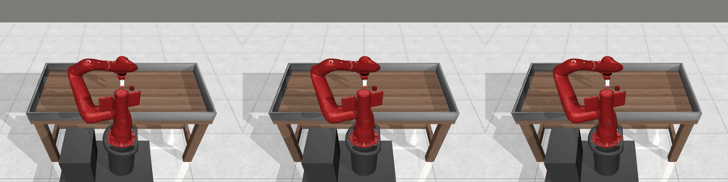

Native MetaWorld action replay: source / perturbed control / recovery. Rendered at a viewing frame rate; not physical-time playback.


**RoboTwin now has successful sources for all 50 task classes.** Initial fixed-seed sweep: 37/50; separate follow-up: 11/26; final bounded bootstrapping: 5/13, retaining all failures. Qualified recovery now covers dual-arm stacking and cup placement, not all 50. [Evidence](docs/task-coverage.md).


### RoboTwin · cup placement: source / error / recovery

Seed 1100: 1,984 / 2,224 / 3,722 real physics steps. Source succeeds, perturbed control fails, replanning succeeds. All three independent replays have zero state error. [Six-attempt report, including failures](docs/evidence/robotwin-more-summary.json).

<table><tr><td><b>source</b><br></td><td><b>perturbed</b><br></td><td><b>recovery</b><br>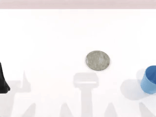</td></tr></table>


## RoboCasa · navigation and manipulation with three error types

Native PandaOmron, PickPlaceCounterToSink, layout/style 1, apple, seed 1100. Three schedules share one scene: source succeeds, perturbed control fails, feedback recovery succeeds. All nine trajectories independently replay with zero state error. [Videos and reproduction](https://pm1255.github.io/robot_stack/robocasa-mobile.html) · [All outcomes, including the earlier failed recovery](docs/robocasa-mobile.md).

<table><tr><th colspan="3">移动中错误转向</th></tr><tr><td><b>正常执行 · 成功</b><br></td><td><b>错误后原动作 · 失败</b><br></td><td><b>当前状态恢复 · 成功</b><br>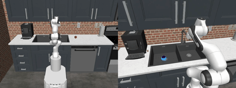</td></tr><tr><th colspan="3">持物时机械臂偏移</th></tr><tr><td><b>正常执行 · 成功</b><br></td><td><b>错误后原动作 · 失败</b><br>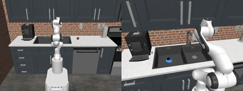</td><td><b>当前状态恢复 · 成功</b><br>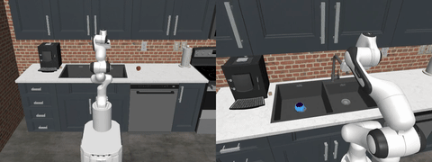</td></tr><tr><th colspan="3">抬起后故意张爪</th></tr><tr><td><b>正常执行 · 成功</b><br></td><td><b>错误后原动作 · 失败</b><br></td><td><b>当前状态恢复 · 成功</b><br></td></tr></table>

## Watch real results directly in this repository

Every animation below is recorded from native simulation. Labels distinguish source demonstrations, verified recovery and MimicGen augmentation. Viewing speed is not simulation time. [Search all tasks and coverage](https://pm1255.github.io/robot_stack/gallery.html).

<table>
<tr><td align="center"><b>MetaWorld · repeated errors</b><br>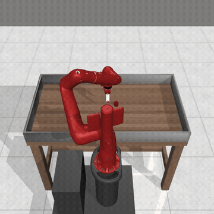<br>Recovery / 3 interventions</td><td align="center"><b>MetaWorld · tool use</b><br>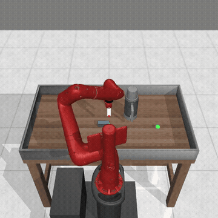<br>Recovery / stick pulling</td></tr>
<tr><td align="center"><b>AI2-THOR · six destinations</b><br>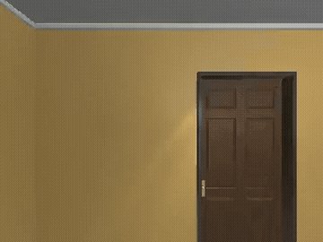<br>Recovery / 3 navigation errors</td><td align="center"><b>RoboCasa · kitchen navigation</b><br>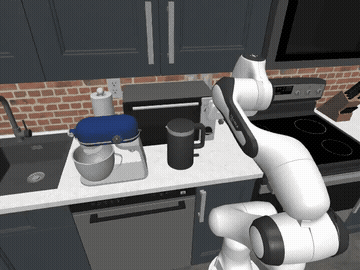<br>Recovery / mobile base</td></tr>
<tr><td align="center"><b>ManiSkill · cube stacking</b><br>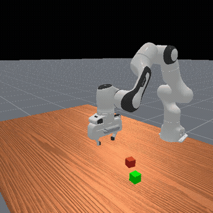<br>Successful source demonstration</td><td align="center"><b>RoboTwin · dual-arm stacking</b><br>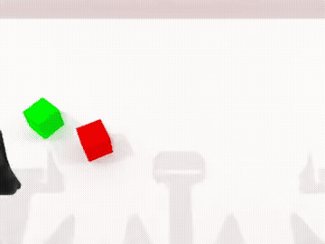<br>Successful source demonstration</td></tr>
<tr><td align="center"><b>MimicGen · generated success</b><br>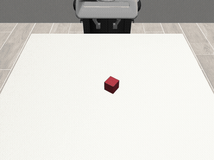<br>Augmented demonstration</td><td align="center"><b>MimicGen · retained failure</b><br>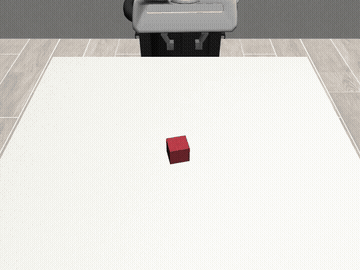<br>Failure / not a recovery sample</td></tr>
</table>


### RoboTwin · deliberate error and recovery in dual-arm stacking

Seed 101: source succeeds in 3,935 physics steps; perturbed control fails after 4,175; recovery succeeds in 7,748. All three independently replay with zero state error. The four-attempt experiment yielded three qualified pairs; the failure is retained. [Replay evidence](docs/evidence/robotwin-carry-replay.json).

<table><tr><th>Source · success</th><th>Perturbed · failure</th><th>Recovery · success</th></tr><tr><td>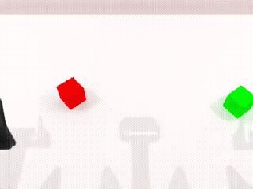</td><td></td><td>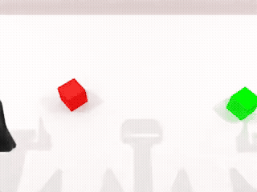</td></tr></table>

### ManiSkill · seven tasks, source / error / recovery

Each row shows native trajectories from the same seed and demonstration: successful source, failed perturbed control, and successful replanned recovery. All 21 independently replayed with zero recorded state error. [Replay evidence](docs/evidence/maniskill-seven-task-replay.json).

<table>
<tr><th>Source · success</th><th>Perturbed · failure</th><th>Recovery · success</th></tr>
<tr><th colspan="3">LiftPegUpright-v1 · seed 810</th></tr>
<tr><td><a href="docs/evidence/maniskill-gallery/LiftPegUpright-v1-source.json"></a></td><td><a href="docs/evidence/maniskill-gallery/LiftPegUpright-v1-perturbed.json">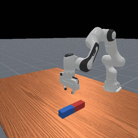</a></td><td><a href="docs/evidence/maniskill-gallery/LiftPegUpright-v1-recovery.json"></a></td></tr>
<tr><th colspan="3">PegInsertionSide-v1 · seed 810</th></tr>
<tr><td><a href="docs/evidence/maniskill-gallery/PegInsertionSide-v1-source.json">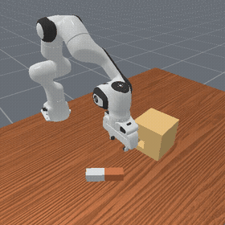</a></td><td><a href="docs/evidence/maniskill-gallery/PegInsertionSide-v1-perturbed.json">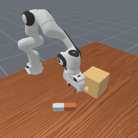</a></td><td><a href="docs/evidence/maniskill-gallery/PegInsertionSide-v1-recovery.json">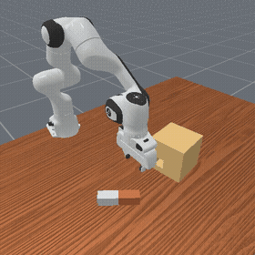</a></td></tr>
<tr><th colspan="3">PickCube-v1 · seed 810</th></tr>
<tr><td><a href="docs/evidence/maniskill-gallery/PickCube-v1-source.json">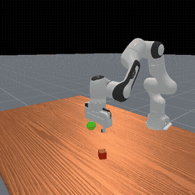</a></td><td><a href="docs/evidence/maniskill-gallery/PickCube-v1-perturbed.json">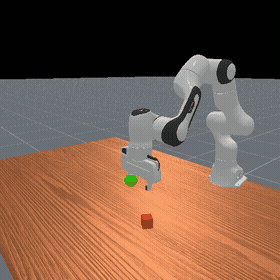</a></td><td><a href="docs/evidence/maniskill-gallery/PickCube-v1-recovery.json">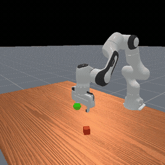</a></td></tr>
<tr><th colspan="3">PlaceSphere-v1 · seed 800</th></tr>
<tr><td><a href="docs/evidence/maniskill-gallery/PlaceSphere-v1-source.json"></a></td><td><a href="docs/evidence/maniskill-gallery/PlaceSphere-v1-perturbed.json">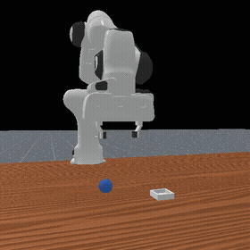</a></td><td><a href="docs/evidence/maniskill-gallery/PlaceSphere-v1-recovery.json">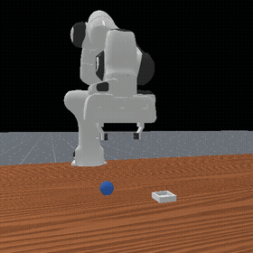</a></td></tr>
<tr><th colspan="3">PullCube-v1 · seed 811</th></tr>
<tr><td><a href="docs/evidence/maniskill-gallery/PullCube-v1-source.json"></a></td><td><a href="docs/evidence/maniskill-gallery/PullCube-v1-perturbed.json"></a></td><td><a href="docs/evidence/maniskill-gallery/PullCube-v1-recovery.json">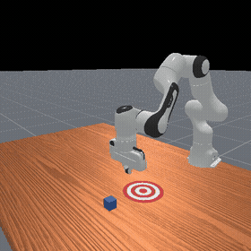</a></td></tr>
<tr><th colspan="3">PushCube-v1 · seed 811</th></tr>
<tr><td><a href="docs/evidence/maniskill-gallery/PushCube-v1-source.json">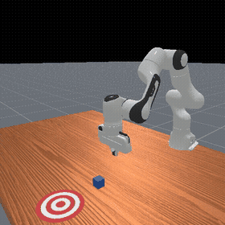</a></td><td><a href="docs/evidence/maniskill-gallery/PushCube-v1-perturbed.json">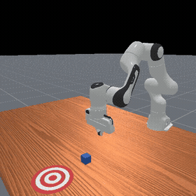</a></td><td><a href="docs/evidence/maniskill-gallery/PushCube-v1-recovery.json"></a></td></tr>
<tr><th colspan="3">StackCube-v1 · seed 810</th></tr>
<tr><td><a href="docs/evidence/maniskill-gallery/StackCube-v1-source.json"></a></td><td><a href="docs/evidence/maniskill-gallery/StackCube-v1-perturbed.json">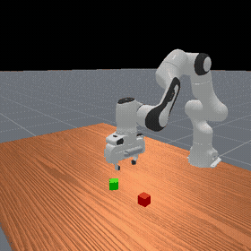</a></td><td><a href="docs/evidence/maniskill-gallery/StackCube-v1-recovery.json"></a></td></tr>
</table>


<details>
<summary>Expand 37 successful RoboTwin source-task animations</summary>

These are the 37 successful source tasks from the unfiltered 50-task sweep at seed 900, recorded during native collection. Source demonstrations here are not counted as correction pairs. The other 13 failures/errors remain in the full report. [All 50 attempts](docs/evidence/robotwin-all-summary.json).

<table>
<tr><td align="center"><b>adjust_bottle</b><br>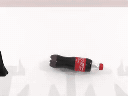<br>82 recorded frames · source</td><td align="center"><b>beat_block_hammer</b><br>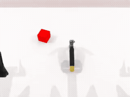<br>65 recorded frames · source</td><td align="center"><b>blocks_ranking_rgb</b><br>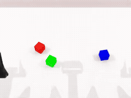<br>254 recorded frames · source</td></tr>
<tr><td align="center"><b>blocks_ranking_size</b><br>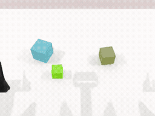<br>264 recorded frames · source</td><td align="center"><b>click_alarmclock</b><br>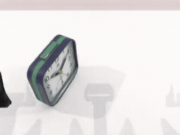<br>52 recorded frames · source</td><td align="center"><b>click_bell</b><br>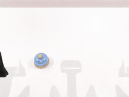<br>44 recorded frames · source</td></tr>
<tr><td align="center"><b>grab_roller</b><br>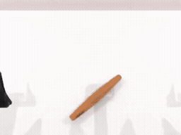<br>52 recorded frames · source</td><td align="center"><b>handover_block</b><br>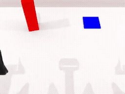<br>169 recorded frames · source</td><td align="center"><b>handover_mic</b><br>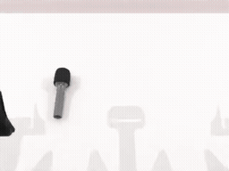<br>124 recorded frames · source</td></tr>
<tr><td align="center"><b>hanging_mug</b><br>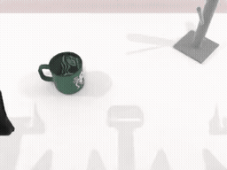<br>196 recorded frames · source</td><td align="center"><b>lift_pot</b><br>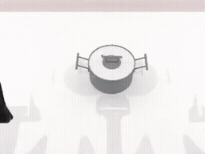<br>61 recorded frames · source</td><td align="center"><b>move_can_pot</b><br>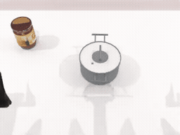<br>83 recorded frames · source</td></tr>
<tr><td align="center"><b>move_playingcard_away</b><br>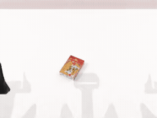<br>63 recorded frames · source</td><td align="center"><b>move_stapler_pad</b><br>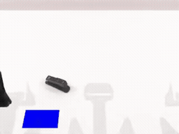<br>80 recorded frames · source</td><td align="center"><b>pick_dual_bottles</b><br>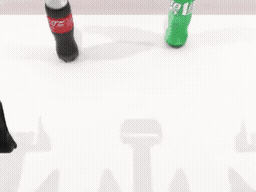<br>70 recorded frames · source</td></tr>
<tr><td align="center"><b>place_a2b_right</b><br>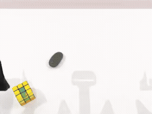<br>81 recorded frames · source</td><td align="center"><b>place_burger_fries</b><br>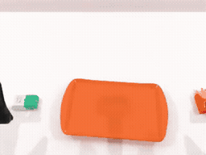<br>132 recorded frames · source</td><td align="center"><b>place_cans_plasticbox</b><br>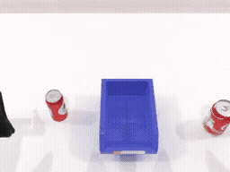<br>159 recorded frames · source</td></tr>
<tr><td align="center"><b>place_container_plate</b><br>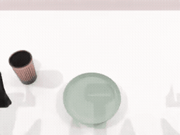<br>89 recorded frames · source</td><td align="center"><b>place_dual_shoes</b><br>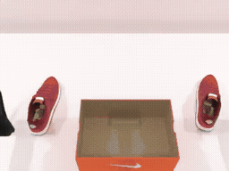<br>128 recorded frames · source</td><td align="center"><b>place_fan</b><br>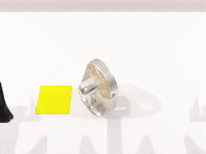<br>87 recorded frames · source</td></tr>
<tr><td align="center"><b>place_mouse_pad</b><br>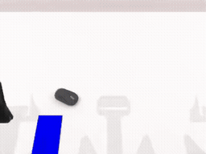<br>86 recorded frames · source</td><td align="center"><b>place_object_basket</b><br><br>139 recorded frames · source</td><td align="center"><b>place_object_scale</b><br><br>80 recorded frames · source</td></tr>
<tr><td align="center"><b>place_object_stand</b><br><br>77 recorded frames · source</td><td align="center"><b>place_phone_stand</b><br><br>71 recorded frames · source</td><td align="center"><b>press_stapler</b><br><br>65 recorded frames · source</td></tr>
<tr><td align="center"><b>put_bottles_dustbin</b><br><br>364 recorded frames · source</td><td align="center"><b>rotate_qrcode</b><br><br>85 recorded frames · source</td><td align="center"><b>shake_bottle</b><br><br>136 recorded frames · source</td></tr>
<tr><td align="center"><b>shake_bottle_horizontally</b><br><br>154 recorded frames · source</td><td align="center"><b>stack_blocks_three</b><br><br>254 recorded frames · source</td><td align="center"><b>stack_blocks_two</b><br><br>173 recorded frames · source</td></tr>
<tr><td align="center"><b>stack_bowls_three</b><br><br>270 recorded frames · source</td><td align="center"><b>stack_bowls_two</b><br><br>183 recorded frames · source</td><td align="center"><b>stamp_seal</b><br><br>77 recorded frames · source</td></tr>
<tr><td align="center"><b>turn_switch</b><br><br>53 recorded frames · source</td></tr>
</table>
</details>


<details>
<summary>Expand 13 additional source-task successes from follow-up collection</summary>

From separately reported fixed-seed follow-ups and bounded success-target collection. These source successes are not correction pairs or part of the initial sweep rate. Each animation links to its experiment report.

<table>
<tr><td align="center"><b>dump_bin_bigbin</b><br><a href="docs/evidence/robotwin-followup-0-summary.json"></a><br>seed 902 · 190 frames · source</td><td align="center"><b>move_pillbottle_pad</b><br><a href="docs/evidence/robotwin-followup-1-summary.json"></a><br>seed 901 · 85 frames · source</td><td align="center"><b>open_laptop</b><br><a href="docs/evidence/robotwin-followup-0-summary.json"></a><br>seed 901 · 84 frames · source</td></tr>
<tr><td align="center"><b>open_microwave</b><br><a href="docs/evidence/robotwin-bootstrap-summary.json"></a><br>seed 903 · 293 frames · source</td><td align="center"><b>pick_diverse_bottles</b><br><a href="docs/evidence/robotwin-bootstrap-summary.json"></a><br>seed 905 · 68 frames · source</td><td align="center"><b>place_a2b_left</b><br><a href="docs/evidence/robotwin-followup-1-summary.json"></a><br>seed 901 · 82 frames · source</td></tr>
<tr><td align="center"><b>place_bread_basket</b><br><a href="docs/evidence/robotwin-followup-0-summary.json"></a><br>seed 901 · 128 frames · source</td><td align="center"><b>place_bread_skillet</b><br><a href="docs/evidence/robotwin-bootstrap-summary.json"></a><br>seed 903 · 96 frames · source</td><td align="center"><b>place_can_basket</b><br><a href="docs/evidence/robotwin-bootstrap-summary.json"></a><br>seed 903 · 136 frames · source</td></tr>
<tr><td align="center"><b>place_empty_cup</b><br><a href="docs/evidence/robotwin-followup-1-summary.json"></a><br>seed 902 · 102 frames · source</td><td align="center"><b>place_shoe</b><br><a href="docs/evidence/robotwin-followup-0-summary.json"></a><br>seed 901 · 102 frames · source</td><td align="center"><b>scan_object</b><br><a href="docs/evidence/robotwin-followup-0-summary.json"></a><br>seed 902 · 92 frames · source</td></tr>
<tr><td align="center"><b>put_object_cabinet</b><br><a href="docs/evidence/robotwin-bootstrap-summary.json"></a><br>seed 909 · 149 frames · source</td></tr>
</table>
</details>

### All 50 MetaWorld task classes: successful recovery

One qualified recovery example per task class, chosen from the documented experiments. Each shown recovery was independently replayed again with zero recorded state error. Click an animation for its replay evidence. Source/control/recovery triplets also passed [150 independent replays](docs/evidence/metaworld50-independent-replay.json). These are example-level results, not a guarantee for all seeds, perturbations or MT50 evaluation settings.

<table>
<tr><td align="center"><b>assembly-v3</b><br><a href="docs/evidence/metaworld50-gallery/assembly-v3.json"></a><br>seed 600 · 219 actions</td><td align="center"><b>basketball-v3</b><br><a href="docs/evidence/metaworld50-gallery/basketball-v3.json"></a><br>seed 600 · 174 actions</td><td align="center"><b>bin-picking-v3</b><br><a href="docs/evidence/metaworld50-gallery/bin-picking-v3.json"></a><br>seed 600 · 220 actions</td></tr>
<tr><td align="center"><b>box-close-v3</b><br><a href="docs/evidence/metaworld50-gallery/box-close-v3.json"></a><br>seed 600 · 158 actions</td><td align="center"><b>button-press-topdown-v3</b><br><a href="docs/evidence/metaworld50-gallery/button-press-topdown-v3.json"></a><br>seed 600 · 104 actions</td><td align="center"><b>button-press-topdown-wall-v3</b><br><a href="docs/evidence/metaworld50-gallery/button-press-topdown-wall-v3.json"></a><br>seed 600 · 94 actions</td></tr>
<tr><td align="center"><b>button-press-v3</b><br><a href="docs/evidence/metaworld50-gallery/button-press-v3.json"></a><br>seed 600 · 97 actions</td><td align="center"><b>button-press-wall-v3</b><br><a href="docs/evidence/metaworld50-gallery/button-press-wall-v3.json"></a><br>seed 600 · 110 actions</td><td align="center"><b>coffee-button-v3</b><br><a href="docs/evidence/metaworld50-gallery/coffee-button-v3.json"></a><br>seed 600 · 79 actions</td></tr>
<tr><td align="center"><b>coffee-pull-v3</b><br><a href="docs/evidence/metaworld50-gallery/coffee-pull-v3.json"></a><br>seed 600 · 103 actions</td><td align="center"><b>coffee-push-v3</b><br><a href="docs/evidence/metaworld50-gallery/coffee-push-v3.json"></a><br>seed 600 · 91 actions</td><td align="center"><b>dial-turn-v3</b><br><a href="docs/evidence/metaworld50-gallery/dial-turn-v3.json"></a><br>seed 600 · 117 actions</td></tr>
<tr><td align="center"><b>disassemble-v3</b><br><a href="docs/evidence/metaworld50-gallery/disassemble-v3.json"></a><br>seed 600 · 203 actions</td><td align="center"><b>door-close-v3</b><br><a href="docs/evidence/metaworld50-gallery/door-close-v3.json"></a><br>seed 600 · 73 actions</td><td align="center"><b>door-lock-v3</b><br><a href="docs/evidence/metaworld50-gallery/door-lock-v3.json"></a><br>seed 600 · 115 actions</td></tr>
<tr><td align="center"><b>door-open-v3</b><br><a href="docs/evidence/metaworld50-gallery/door-open-v3.json"></a><br>seed 600 · 121 actions</td><td align="center"><b>door-unlock-v3</b><br><a href="docs/evidence/metaworld50-gallery/door-unlock-v3.json"></a><br>seed 600 · 88 actions</td><td align="center"><b>drawer-close-v3</b><br><a href="docs/evidence/metaworld50-gallery/drawer-close-v3.json"></a><br>seed 600 · 108 actions</td></tr>
<tr><td align="center"><b>drawer-open-v3</b><br><a href="docs/evidence/metaworld50-gallery/drawer-open-v3.json"></a><br>seed 600 · 149 actions</td><td align="center"><b>faucet-close-v3</b><br><a href="docs/evidence/metaworld50-gallery/faucet-close-v3.json"></a><br>seed 600 · 95 actions</td><td align="center"><b>faucet-open-v3</b><br><a href="docs/evidence/metaworld50-gallery/faucet-open-v3.json"></a><br>seed 600 · 92 actions</td></tr>
<tr><td align="center"><b>hammer-v3</b><br><a href="docs/evidence/metaworld50-gallery/hammer-v3.json"></a><br>seed 600 · 103 actions</td><td align="center"><b>hand-insert-v3</b><br><a href="docs/evidence/metaworld50-gallery/hand-insert-v3.json"></a><br>seed 600 · 95 actions</td><td align="center"><b>handle-press-side-v3</b><br><a href="docs/evidence/metaworld50-gallery/handle-press-side-v3.json"></a><br>seed 600 · 80 actions</td></tr>
<tr><td align="center"><b>handle-press-v3</b><br><a href="docs/evidence/metaworld50-gallery/handle-press-v3.json"></a><br>seed 600 · 79 actions</td><td align="center"><b>handle-pull-side-v3</b><br><a href="docs/evidence/metaworld50-gallery/handle-pull-side-v3.json"></a><br>seed 600 · 115 actions</td><td align="center"><b>handle-pull-v3</b><br><a href="docs/evidence/metaworld50-gallery/handle-pull-v3.json"></a><br>seed 600 · 156 actions</td></tr>
<tr><td align="center"><b>lever-pull-v3</b><br><a href="docs/evidence/metaworld50-gallery/lever-pull-v3.json"></a><br>seed 600 · 105 actions</td><td align="center"><b>peg-insert-side-v3</b><br><a href="docs/evidence/metaworld50-gallery/peg-insert-side-v3.json"></a><br>seed 600 · 125 actions</td><td align="center"><b>peg-unplug-side-v3</b><br><a href="docs/evidence/metaworld50-gallery/peg-unplug-side-v3.json"></a><br>seed 600 · 151 actions</td></tr>
<tr><td align="center"><b>pick-out-of-hole-v3</b><br><a href="docs/evidence/metaworld50-gallery/pick-out-of-hole-v3.json"></a><br>seed 600 · 178 actions</td><td align="center"><b>pick-place-v3</b><br><a href="docs/evidence/metaworld50-gallery/pick-place-v3.json"></a><br>seed 600 · 88 actions</td><td align="center"><b>pick-place-wall-v3</b><br><a href="docs/evidence/metaworld50-gallery/pick-place-wall-v3.json"></a><br>seed 600 · 183 actions</td></tr>
<tr><td align="center"><b>plate-slide-back-side-v3</b><br><a href="docs/evidence/metaworld50-gallery/plate-slide-back-side-v3.json"></a><br>seed 600 · 95 actions</td><td align="center"><b>plate-slide-back-v3</b><br><a href="docs/evidence/metaworld50-gallery/plate-slide-back-v3.json"></a><br>seed 600 · 81 actions</td><td align="center"><b>plate-slide-side-v3</b><br><a href="docs/evidence/metaworld50-gallery/plate-slide-side-v3.json"></a><br>seed 600 · 213 actions</td></tr>
<tr><td align="center"><b>plate-slide-v3</b><br><a href="docs/evidence/metaworld50-gallery/plate-slide-v3.json"></a><br>seed 600 · 88 actions</td><td align="center"><b>push-back-v3</b><br><a href="docs/evidence/metaworld50-gallery/push-back-v3.json"></a><br>seed 600 · 116 actions</td><td align="center"><b>push-v3</b><br><a href="docs/evidence/metaworld50-gallery/push-v3.json"></a><br>seed 600 · 96 actions</td></tr>
<tr><td align="center"><b>push-wall-v3</b><br><a href="docs/evidence/metaworld50-gallery/push-wall-v3.json"></a><br>seed 600 · 151 actions</td><td align="center"><b>reach-v3</b><br><a href="docs/evidence/metaworld50-gallery/reach-v3.json"></a><br>seed 600 · 65 actions</td><td align="center"><b>reach-wall-v3</b><br><a href="docs/evidence/metaworld50-gallery/reach-wall-v3.json"></a><br>seed 600 · 68 actions</td></tr>
<tr><td align="center"><b>shelf-place-v3</b><br><a href="docs/evidence/metaworld50-gallery/shelf-place-v3.json"></a><br>seed 600 · 150 actions</td><td align="center"><b>soccer-v3</b><br><a href="docs/evidence/metaworld50-gallery/soccer-v3.json"></a><br>seed 600 · 143 actions</td><td align="center"><b>stick-pull-v3</b><br><a href="docs/evidence/metaworld50-gallery/stick-pull-v3.json"></a><br>seed 621 · 186 actions</td></tr>
<tr><td align="center"><b>stick-push-v3</b><br><a href="docs/evidence/metaworld50-gallery/stick-push-v3.json"></a><br>seed 622 · 105 actions</td><td align="center"><b>sweep-into-v3</b><br><a href="docs/evidence/metaworld50-gallery/sweep-into-v3.json"></a><br>seed 600 · 114 actions</td><td align="center"><b>sweep-v3</b><br><a href="docs/evidence/metaworld50-gallery/sweep-v3.json"></a><br>seed 600 · 144 actions</td></tr>
<tr><td align="center"><b>window-close-v3</b><br><a href="docs/evidence/metaworld50-gallery/window-close-v3.json"></a><br>seed 600 · 114 actions</td><td align="center"><b>window-open-v3</b><br><a href="docs/evidence/metaworld50-gallery/window-open-v3.json"></a><br>seed 600 · 122 actions</td></tr>
</table>

## Why paired trajectories?

A successful endpoint alone does not prove correction. Each eligible sample contains:


Both branches reconstruct the source prefix through actual actions. Recovery never resets the environment, teleports the robot, attaches the object, or installs a successful simulator state. The protocol measures recovery from a specified injected error; it does not claim superiority over another closed-loop policy.

## What has actually run?

| Integration | Native collection evidence | Perturbation / recovery |
| --- | --- | --- |
| MetaWorld full task-class sweep | All 50 registered classes have qualified samples across first sweep + tool follow-up | First sweep **69/100**; separate follow-up **18/40**. One triplet per class: **150/150 native replays pass, state error 0**. [Full conditions](docs/scheduled-results.md) |
| MetaWorld 3.1.1 | 8 selected tasks, **80/80** successful demonstrations | Generic three-branch protocol: **100/100 qualified pairs** across push and pick-place, 50 native task instances each |
| robosuite Lift | 20/20 clean, 0/20 grasp-offset control, 20/20 recovery | Earlier bounded retry experiment; distinct from the new source-prefix branching protocol |
| ManiSkill 3.0.1 | Current 12-expert sweep: **19/24** successful sources across 10 classes; four setup errors retained | **8/24** qualified pairs; combined with the first trial, **7 classes** have qualified examples. [Conditions](docs/task-coverage.md) |
| RoboTwin | All 50 native experts attempted: **37/50** successful sources at seed 900 | stack_blocks_two: **3/4 qualified pairs**, 12 files audited; arbitrary-task recovery remains experimental. [Conditions](docs/task-coverage.md) |
| RoboCasa 1.0.1 | NavigateKitchen, layout/style 1, seeds 220–222 | **3/3 qualified navigation correction pairs**; seed 220 independently replayed with zero state error |
| AI2-THOR 5.0.0 | Native FloorPlan1 PointNav, seeds 220–222 | **3/3 qualified navigation correction pairs**; independent recovery replay has zero pose error |
| RoboDojo | Shared official assets and Isaac Sim 5.1 / IsaacLab environment located | **Native stack_bowls reset + 10 physics steps verified**; task policy success remains unverified |
| MimicGen | Official generator, two Lift sources → ten new trajectories | **7/10 successful**; all ten independently replayed; augmented demos, not correction pairs |

The 100 MetaWorld pairs are a fixed-configuration experiment: task indices 0–49, reset seeds 300–349, a 15-step Cartesian error burst, and a 500-action cap. All failures and non-qualifying attempts remain in the dataset. This is not complete MT10/MT50 evaluation. See [data semantics](docs/correction-protocol.md) and [earlier benchmark conditions](docs/benchmarks.md).

Caching task definitions reduced measured collection time from 155 to 43 seconds (push) and 150 to 45 seconds (pick-place), including reconstruction and saving. All 300 trajectory files had identical states, actions, phases and success labels before/after the optimization. These concurrent shared-server measurements are not isolated throughput benchmarks. [Audit and timing evidence](docs/evidence/metaworld-cache-comparison.json). The repeated timing baseline and earlier 10-pair pilot are excluded from the 100-pair total.

## Reproduce a correction experiment

Use a separate Python 3.10 environment for each simulator. The core itself needs only NumPy and h5py.

```bash
git clone https://github.com/pm1255/robot_stack.git
cd robot_stack
python -m venv .venv
source .venv/bin/activate
pip install -e '.[metaworld]'

MUJOCO_GL=egl OPENBLAS_NUM_THREADS=1 OMP_NUM_THREADS=1 \
  robot-stack-collect --backend metaworld --task pick-place-v3 \
  --output outputs/pick-place --episodes 50 --seed-start 300 \
  --max-steps 500 --perturb-steps 15

python -m robot_stack.audit outputs/pick-place --output outputs/pick-place-audit.json
robot-stack-replay outputs/pick-place/ep_0300/recovery.hdf5 \
  --output outputs/replay.json --video outputs/recovery.mp4
```

Replay video needs EGL and FFmpeg. Each new run requires a new output directory. MetaWorld uses different native task indices by default; setting `task_index` explicitly in `--adapter-options` intentionally holds that task instance fixed.

```text
outputs/pick-place/
  run_config.json
  summary.json
  ep_0220/
    source.hdf5                 # successful source
    perturbed.hdf5              # original suffix after injected actions
    recovery.hdf5               # feedback from the same error state
    *_episode_result.json      # native outcome, provenance, SHA256
    correction.json            # eligibility and paired-state checks
```

The HDF5 files contain T actions, T post-action success labels and T+1 states. Phase labels and half-open action ranges identify the perturbation and recovery. Use **`split_group`**, not episode filenames, when splitting training and validation; identical initial states are conservatively grouped even if reset seeds differ.

## Navigation and extending tasks

The new adapter API is in [`robot_stack/core.py`](robot_stack/core.py). A policy chooses actions; an adapter executes them, returns numeric state and evaluates the task. The core handles branching, provenance, budgets and paired labels. Implement an adapter and call `collect_triplet(...)` to use a different policy or task.

- **RoboCasa:** the current controller targets native `NavigateKitchen` using the native base Jacobian, bounded friction compensation and PandaOmron base velocities and the environment's position/orientation success check. It requires matching kitchen assets. It is not yet a general collision-aware mobile manipulation planner.
- **AI2-THOR:** the current adapter performs oracle PointNav in a native `FloorPlan` scene using `GetReachablePositions`, grid planning, physical moves and rotations. This is not official ObjectNav evaluation. It records agent pose in a static scene, not a full Unity snapshot.
- **RoboDojo:** the bridge accepts a caller-created official `EvalEnv`, a real policy callback, a state reader and a perturbation generator. `success=True` alone is insufficient: native completion and actual execution are also required. See [integration setup](docs/navigation.md).

The original Isaac/A2D pipeline remains in `isaac_collector/`; its planner/execution checks have been improved, but its task completion is still unverified. [Implementation notes](docs/implementation-history.zh-CN.md) document that boundary.

A small [native correction triplet](examples/correction/) is included for inspection. Validate its files without a simulator: `python -m robot_stack.audit examples/correction --output /tmp/robot-stack-example-audit.json`.

## Inspect results and contribute

```bash
python scripts/build_collection_report.py --input outputs/pick-place --output docs/report.json
python -m http.server 8000 --directory docs
python -m unittest discover -s tests -v
```

The static dashboard shows real records and local videos, and can be deployed with the GitHub Pages workflow. CI runs lightweight contract tests; native simulator checks are separate and must not be inferred from a green CI badge.

MimicGen now has a native **prepare → generate → replay** path for Panda Lift. Preparation verifies source dynamics and derives grasp/lift subtask annotations; generation retains failures and checks final stable success. [Reproduction commands and measured limits](docs/mimicgen.md). Extending it to another task still requires its object frames, action conversion and subtask boundaries.

Next milestones are collision-aware navigation, more task policies, controlled natural-failure recovery and MimicGen integration for additional tasks. A simulator name or HDF5 extension is not a compatibility guarantee.

We build on [robosuite](https://github.com/ARISE-Initiative/robosuite), [MetaWorld](https://github.com/Farama-Foundation/Metaworld), [ManiSkill](https://github.com/haosulab/ManiSkill), [RoboTwin](https://github.com/RoboTwin-Platform/RoboTwin), [RoboCasa](https://github.com/robocasa/robocasa), [RoboDojo](https://github.com/RoboDojo-Benchmark/RoboDojo), [AI2-THOR](https://github.com/allenai/ai2thor), and [MimicGen](https://github.com/NVlabs/mimicgen). Their code, assets and policies retain their upstream terms and attribution.
